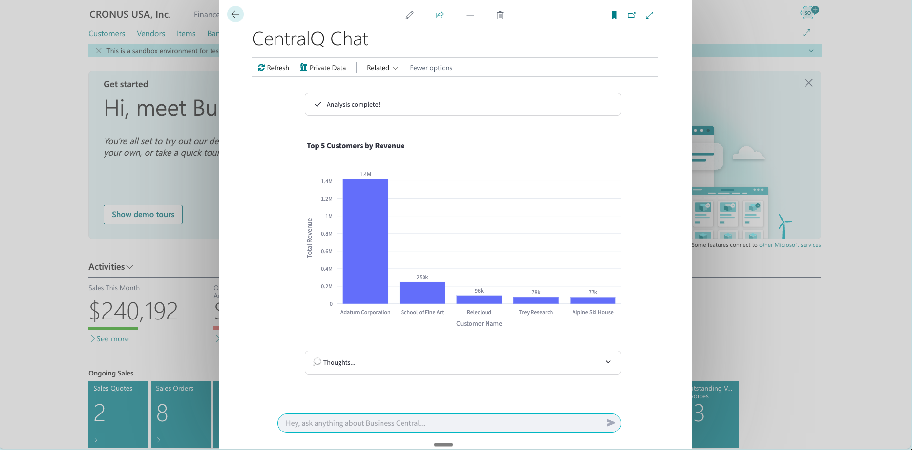
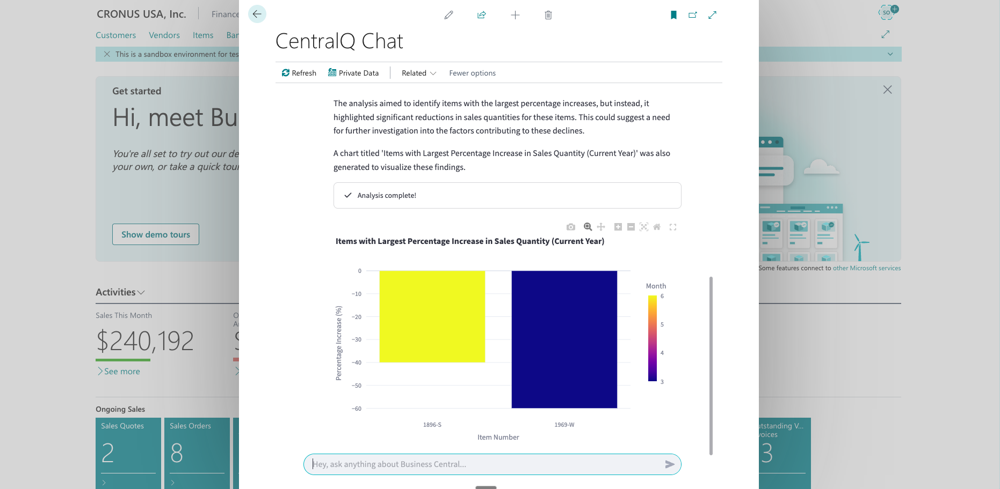
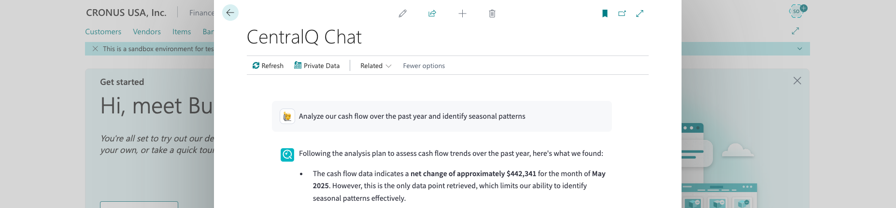
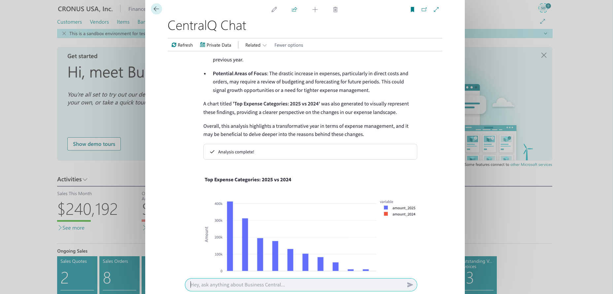
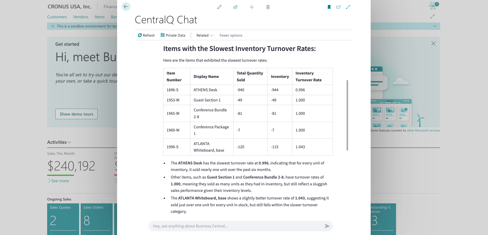
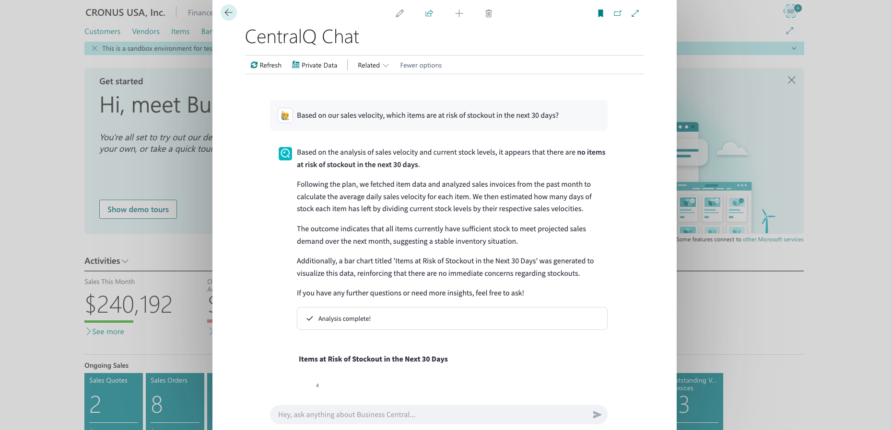

# Data Insights Agent: Examples & Use Cases

This page provides practical examples of how to use the Data Insights Agent with your Business Central data.

<iframe src="https://player.vimeo.com/video/1085920525?badge=0&amp;autopause=0&amp;player_id=0&amp;app_id=58479" frameborder="0" allow="autoplay; fullscreen; picture-in-picture; clipboard-write; encrypted-media" style="position:absolute;top:0;left:0;width:100%;height:100%;" title="centralq-chat-data-insights-sales-trend-example"></iframe>

!!! tip "Example images"
    The screenshots and visualizations shown are examples. Your actual results will depend on your specific Business Central data and question phrasing.

## Sales Analysis Examples

### Example 1: Sales Trends by Customer

**Question**: "Show me the top 5 customers by sales amount for the last 3 months and how their purchases have trended over time"

**What You'll Get**:

- A bar chart showing your top 5 customers by revenue
- A line chart showing the sales trend for these customers 
- Analysis of which customers are growing or declining

{ align=center }

**Business Value**: Identify your most valuable customers and spot changing purchasing patterns.

### Example 2: Product Performance Analysis

**Question**: "Which items had the largest percentage increase in sales quantity compared to the previous quarter?"

**What You'll Get**:

- Visualization of products with significant growth
- Percentage changes in sales quantities
- Identification of emerging popular products

<figure markdown>
  { width="600" }
  <figcaption>Product growth comparison visualization</figcaption>
</figure>

**Business Value**: Discover growing product trends early to optimize inventory and marketing focus.

## Financial Analysis Examples

### Example 3: Cash Flow Patterns

**Question**: "Analyze our cash flow over the past year and identify seasonal patterns"

**What You'll Get**:

- Monthly cash flow visualization
- Highlighted seasonal patterns
- Comparison of cash inflows vs outflows

{ loading=lazy }

**Business Value**: Better predict cash position and plan for seasonal fluctuations.

### Example 4: Expense Categories Breakdown

**Question**: "What are our top expense categories this year compared to last year?"

**What You'll Get**:

- Comparative visualization of expense categories
- Year-over-year percentage changes
- Identification of growing cost centers

**Business Value**: Identify cost increases that require management attention.

## Inventory Management Examples

### Example 5: Inventory Turnover Analysis

**Question**: "Show me items with the slowest inventory turnover rates in the past 6 months"

**What You'll Get**:

- Chart of slow-moving inventory items
- Turnover rates compared to average
- Age of inventory metrics

{ align=center }

**Business Value**: Identify potentially obsolete inventory for promotions or write-downs.

### Example 6: Stock Level Optimization

**Question**: "Based on our sales velocity, which items are at risk of stockout in the next 30 days?"

**What You'll Get**:

- List of at-risk items
- Current stock levels vs projected demand
- Days of supply remaining

<figure markdown>
  { width="700" }
  <figcaption>Visualization of items at risk of stockout</figcaption>
</figure>

**Business Value**: Proactively manage inventory to prevent lost sales due to stockouts.

## Tips for Effective Queries

To get the most from the Data Insights Agent:

1. **Include timeframes**: Specify the time period (e.g., "last quarter," "year to date," "past 6 months")

2. **Mention specific metrics**: Clearly state what you want to measure (sales amount, quantity, profit margin)

3. **Ask for comparisons**: Request comparative analysis (e.g., "compared to same period last year")

4. **Specify visualization types**: Request specific chart types if needed (e.g., "show me a trend line")

5. **Use follow-up questions**: Build on initial queries to explore further

## Follow-up Question Examples

Initial: "Show me sales by region for this year"

Effective follow-ups:

- "Which product categories are driving the growth in the Western region?"
- "Compare the customer retention rate between our top and bottom performing regions"
- "What's the profit margin difference between regions?"

## Next Steps

- ➡️ **[Getting Started](./getting-started.md)**: Enable and configure the agent
- 🔒 **[Security](./security.md)**: Learn about data privacy and security 
- ✨ **[Key Features](./features.md)**: Discover all capabilities 