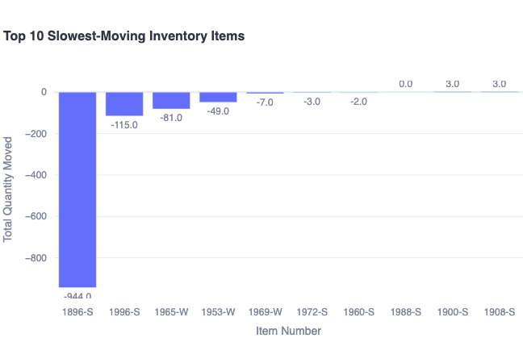
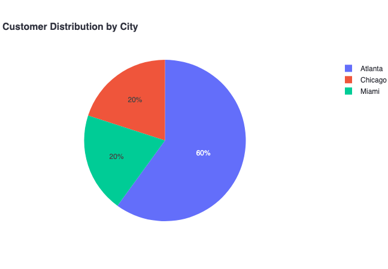
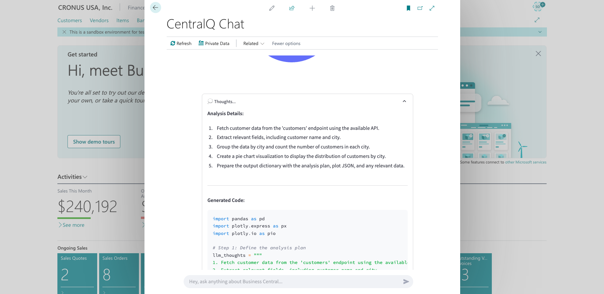

# Key Features of the Data Insights Agent

The Data Insights Agent transforms CentralQ Chat into a powerful data analysis tool for Microsoft Dynamics 365 Business Central. Ask questions in natural language and get instant insights with visualizations to make better business decisions.

<iframe src="https://player.vimeo.com/video/1085696239?badge=0&amp;autopause=0&amp;player_id=0&amp;app_id=58479" frameborder="0" allow="autoplay; fullscreen; picture-in-picture; clipboard-write; encrypted-media" style="position:absolute;top:0;left:0;width:100%;height:100%;" title="centralq-chat-inventory-levels"></iframe>

## Business Questions You Can Ask

Ask a wide range of questions about your operations, customers, and financials:

### Sales Performance
- "What were our total sales last month?"
- "Show me the sales trend for item 'X' over the past year."
- "Who are my top 5 customers by revenue in Q1?"
- "Which salesperson had the highest sales this quarter?"

### Customer Analysis
- "Which customers haven't ordered in the last 90 days?"
- "What's the average order value for customer group 'Retail'?"
- "Compare customer retention rates by region"

### Inventory Management
- "What are the current inventory levels for product category 'Components'?"
- "Show me items with stock below their reorder point."
- "Which items are our slowest-moving inventory?"

### Financial Insights
- "What is our total accounts receivable balance?"
- "Compare actual vs. budgeted expenses for the 'Marketing' department."
- "Show me the trend of our gross profit margin over the last four quarters."

## Available Business Central Data

The Data Insights Agent works with:

- **Standard APIs**: Sales, Purchasing, Inventory, Financials, Customer records, Vendor records, and more.
- **Custom APIs**: If your custom fields or tables are accessible through Business Central APIs, the agent can use this data too, without any additional configuration.

!!! info "Data Access Requirements"
    Two factors determine what data you can analyze:
    
    1. **API Availability**: The data must be accessible through Business Central APIs.
    2. **User Permissions**: You will only see data that your Business Central user account has permission to access.

## Response Format

The Data Insights Agent provides answers in a clear, easy-to-understand format:

- **Text Summaries**: Concise answers that directly address your question.
- **Visualizations**: Automatically generated charts (bar charts, line graphs, pie charts) to help you spot trends and patterns.
- **"Thoughts" Section**: For transparency, you can expand this section to see how the answer was derived, including the code used.

-   { loading=lazy }

    ---

    Bar chart showing the top 10 slowest-moving inventory items

-   { loading=lazy }

    ---

    Pie chart displaying customer distribution by cities

## Analysis Capabilities

The Data Insights Agent can perform complex analysis on your Business Central data:

- **Group and Summarize**: 
    - See data rolled up by categories
    - Example: "What are the total sales for each product category?"

- **Sort and Rank**: 
    - Identify top or bottom performers
    - Example: "List my top 10 customers by sales volume"

- **Filter Data**: 
    - Focus on specific segments or timeframes
    - Example: "Show me sales orders created last week for customer 'Contoso'"

- **Combine Information**: 
    - Connect related data from different parts of Business Central
    - Example: "For customers in the 'VIP' segment, show their total sales and number of orders"

- **Perform Calculations**: 
    - Get sums, averages, percentages, and other calculations
    - Example: "Calculate the percentage change in sales compared to last month"

- **Identify Trends**: 
    - Understand changes over time
    - Example: "Show the monthly sales trend for the past year"

## LLM "Thoughts"

Every Data Insights response includes a collapsible "Thoughts" section that provides complete transparency into how your answer was generated:

- **LLM Reasoning**: See the step-by-step thought process the AI used to interpret your question and plan the analysis.
- **Generated Python Code**: Examine the actual code created to query your Business Central data.
- **Execution Details**: View how the data was processed, transformed, and visualized.

This transparency helps you:

- Understand how the AI reached its conclusions
- Verify the accuracy of the analysis
- Learn which tables and fields were used to answer your question
- Build trust in the data being presented

{ loading=lazy }

## Key Benefits

- **Save Time**: Get answers in seconds instead of building reports.
- **Empower Users**: No special data skills needed to get insights.
- **Improve Decisions**: Access data-driven insights instantly.
- **Integrated Workflow**: Analysis happens right in Business Central.

!!! note "Data Privacy"
    Your business data privacy is a priority. The actual data values retrieved from Business Central are not logged or stored by CentralQ Chat. For more details, see our [Telemetry documentation](../telemetry.md).

## Next Steps

- ➡️ **[Getting Started](./getting-started.md)**: Set up and start using the agent.
- ⚙️ **[How It Works](./how-it-works.md)**: Understand the underlying technology.
- 🛡️ **[Security Details](./security.md)**: Learn about security measures.
- 📊 **[Examples & Use Cases](./examples.md)**: See practical examples of the agent in action. 