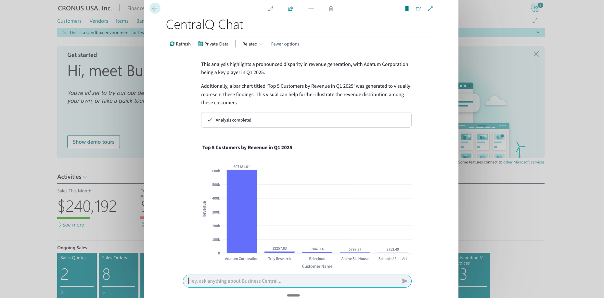

# Getting Started with the Data Insights Agent

The Data Insights Agent allows you to query and analyze your Business Central data using natural language. This guide explains how to enable and use this feature.

<iframe src="https://player.vimeo.com/video/1085646199?badge=0&amp;autopause=0&amp;player_id=0&amp;app_id=58479" frameborder="0" allow="autoplay; fullscreen; picture-in-picture; clipboard-write; encrypted-media" style="position:absolute;top:0;left:0;width:100%;height:100%;" title="centralq-chat-data-insights-agent-with-follow-up"></iframe>

## Prerequisites

Before you begin, please ensure the following conditions are met:

- **CentralQ Chat Installed**: CentralQ Chat must be installed and configured in your Business Central environment. See the [Installation Guide](../installation.md) and [Configuration Guide](../configuration.md).
- **Permissions**:
    - **To configure**: Users need the `GPT CQC - ADMIN` or `GPT CQC - SETUP` permission set
    - **To use**: Users need appropriate permissions to access the Business Central data they want to query
- **Microsoft Entra Application**: A Microsoft Entra (formerly Azure Active Directory) application registration is 
required with the necessary API permissions for Business Central. You will need this application's **Client ID** and a 
generated **Client Secret** during the setup process.
    *   Within your Microsoft Entra application, you must grant API permissions for **Dynamics 365 Business Central**.
    *   The specific permissions required are:
        *   `Financials.ReadWrite.All` (Application Permission)
        *   `User.Read` (Application Permission - often needed for user context)
        *   `user_impersonation` (Delegated Permission - typically for Dynamics 365 Business Central API)

!!! note
    Verify the exact API permissions based on your Business Central version and security requirements.

## Enabling the Data Insights Agent

Follow these steps to enable the feature:

1. **Navigate to CentralQ Chat Setup**:
   - In Business Central, search (Alt+Q) for **"CentralQ Chat Setup"**

2.  **Locate the Insights Agent Section**:
    *   On the "CentralQ Chat Setup" page, find the **"Chat experience"** FastTab.
    *   Within this section, you will see a toggle field labeled **"Use Insights Agent"**.

    
    *Caption: The "Use Insights Agent" toggle in CentralQ Chat Setup.*

3.  **Enable the Agent**:
    *   Click the **"Use Insights Agent"** toggle to enable the feature.

4.  **Configure Credentials (If Prompted)**:
    *   If this is the first time you are enabling the Insights Agent, or if credentials haven't been configured yet, the **"Insights Agent Wizard"** will automatically open.
    *   This wizard will guide you through entering the **Client ID** and **Client Secret** from your Microsoft Entra application.

    
    *Caption: The Insights Agent Wizard for credential setup.*

    *   **Client ID**: Enter the Application (client) ID of your registered Microsoft Entra application.
    *   **Client Secret**: Enter the client secret generated for your Microsoft Entra application.

5. **Alternative Setup Methods**:
   - **Manual setup**: If you need to (re)configure credentials at any time, you can use the **"Setup Insights Agent"** action on the CentralQ Chat Setup page
   - **Notification**: Click the **"Enable Insights Agent"** action if you see a notification prompt

    
    *Caption: The "Setup Insights Agent" action in CentralQ Chat Setup.*

Once configured, the Data Insights Agent is ready to use.

## Your First Data Query

With the Data Insights Agent active:

1. **Open CentralQ Chat**

2. **Ask Your Question** in natural language. For example:
    - "What were our total sales last month?"
    - "Show me the top 5 customers by revenue in Q1."
    - "List open sales orders for customer 'Contoso'."

3. **Review the Results**:
    - The agent interprets your question
    - Fetches and analyzes the relevant data
    - Presents answers with text and visualizations

*Caption: Example of a data query and response in CentralQ Chat using the Data Insights Agent.*

## Tips for Effective Queries
To get the best results from the Data Insights Agent:

*   **Be Specific**: The more specific your question, the more accurate the results. For instance, instead of "Show sales," try "Show total sales revenue for item 'X' in January 2024."
*   **Use Known Terms**: While the agent is designed for natural language, using terms that align with your Business Central fields or common business language (e.g., "customer ledger entries," "G/L accounts," "sales orders") can improve understanding.
*   **Start Simple**: If you have a complex query, try breaking it down into simpler questions first.
*   **Iterate**: If the initial response isn't exactly what you need, refine your question and ask again. You can also ask follow-up questions.

*Caption: Example of a data query and response in CentralQ Chat using the Data Insights Agent.*
## Next Steps

Now that you're started, explore more about what the Data Insights Agent can do:

- ✨ **[Key Features](./features.md)**: Discover all capabilities
- ⚙️ **[How It Works](./how-it-works.md)**: Understand the technical architecture
- 🛡️ **[Security](./security.md)**: Learn about security measures
- 📊 **[Examples & Use Cases](./examples.md)**: See practical examples 