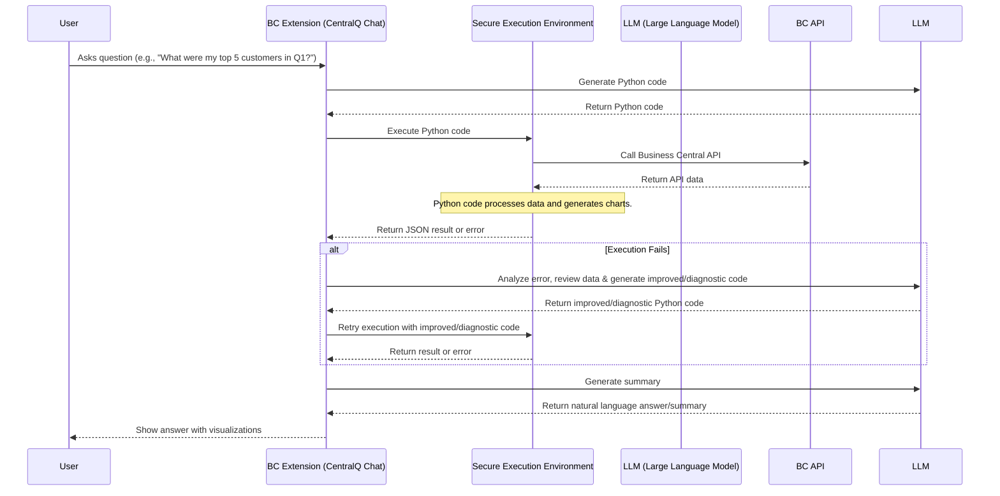
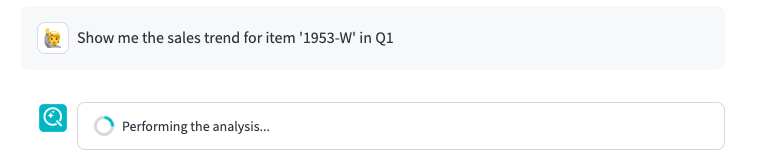
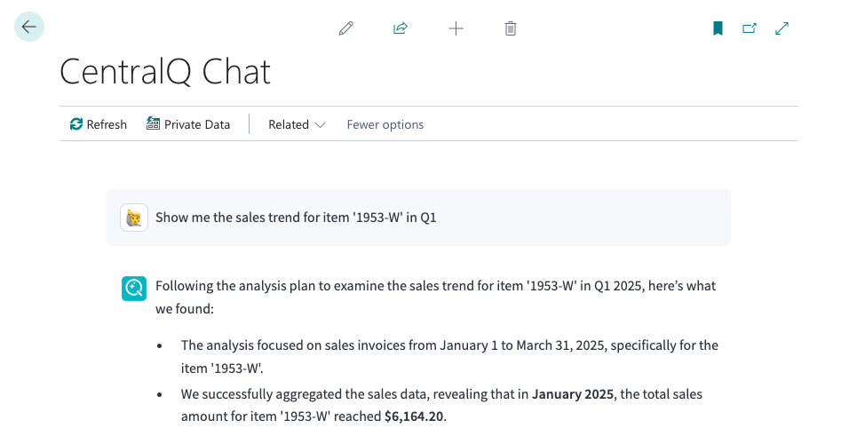

# How the Data Insights Agent Works

The Data Insights Agent uses a sophisticated process to turn your natural language questions about Business Central data into actionable insights and visualizations.

<iframe src="https://player.vimeo.com/video/1085915132?badge=0&amp;autopause=0&amp;player_id=0&amp;app_id=58479" frameborder="0" allow="autoplay; fullscreen; picture-in-picture; clipboard-write; encrypted-media" style="position:absolute;top:0;left:0;width:100%;height:100%;" title="centralq-chat-data-insights-item-sales"></iframe>

## The Process: From Question to Insight

## Step-by-Step Breakdown

1. **You Ask the Question**:

      - You type your business question in plain English directly into the CentralQ Chat interface
      - Example: "Show me the sales trend for item 'X' in Q1"
      

2. **AI Generates Code**:
      - Your question, along with contextual information (like the Business Central APIs available to you), is sent to an  advanced Large Language Model (LLM).
      - The LLM analyzes your request and generates Python code specifically designed to fetch the required data from  Business Central and perform the necessary analysis or visualization.
      

3. **Secure Code Execution**:
      - The Python code generated by the LLM is sent to a secure, isolated execution environment.
      - This environment includes necessary libraries for data manipulation and visualization
      - Your Business Central API authentication token is securely passed into this environment only at 
      runtime, ensuring it's not stored long-term with the code.

        !!! info "Secure by Design"
            The execution environment is sandboxed, ensuring complete isolation from your main Business Central system.

4. **Data Retrieval**
      - The Python code makes calls to the Business Central API
      - It retrieves the specific data needed to answer your question
   
        !!! info "Respecting Permissions"
            All data access strictly follows your existing Business Central user permissions. The agent can only retrieve data you're authorized to see.

5. **Analysis & Visualization**
      - The code processes the retrieved data (filtering, sorting, calculations and other data manipulations)
      - It generates appropriate visualizations (charts)
      - It also creates "thoughts" about the analysis process

         

6. **Results Delivery**
      - The processed results are sent back to CentralQ Chat

7. **Smart Retry (If Needed)**
      - If the initial code execution fails, CentralQ Chat doesn't give up
      - The error, original code, and your question are sent back to the LLM
      - The LLM generates diagnostic or corrected code
      - This can be attempted up to 3 times

8. **Natural Language Summary**
      - Once successful, the results are used to generate an easy-to-understand answer
      - This includes both text explanations and visual elements

9. **Final Presentation**
      - You receive the natural language answer and any visualizations
      - You can expand the "Thoughts" section to see the reasoning and code
      

10. **Follow-Up Questions**
      - You can ask follow-up questions to dive deeper or explore new angles
      - Example: After seeing sales by region, ask "Now show that for only Q1"
      - The system remembers context from your current session

        !!! tip "Effective Follow-Ups"
            For best results, be clear about how your new question relates to the previous one. Referring to specific elements from the last answer can help.

This process allows you to get sophisticated data insights quickly and easily through a simple conversation.

## Next Steps

- ➡️ **[Getting Started](./getting-started.md)**: Enable and configure the Data Insights Agent.
- ✨ **[Key Features](./features.md)**: Review the capabilities of the Data Insights Agent.
- 🛡️ **[Security](./security.md)**: Learn more about security measures.
- 📊 **[Examples & Use Cases](./examples.md)**: Explore practical examples and scenarios.

*   ❓ **[FAQ](../faq.md)**: Find answers to common questions about CentralQ Chat, including the Data Insights Agent. 