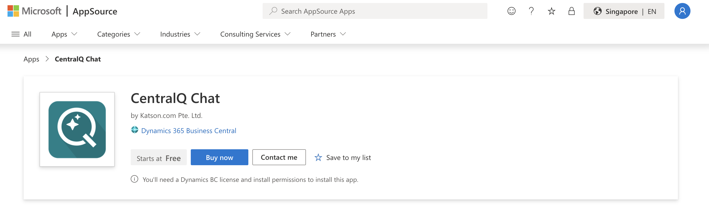

This guide outlines the steps to purchase, install, and prepare CentralQ Chat in Business Central, ensuring a smooth deployment for your team.

### Purchase the App from AppSource

1. **Finding and Purchasing**: Visit [AppSource](https://appsource.microsoft.com) and search for "CentralQ Chat" or navigate to the [CentralQ Chat page](https://appsource.microsoft.com/en-us/product/dynamics-365-business-central/PUBID.katson_com%7CAID.centralq-chat%7CPAPPID.98a1b34c-3b9e-445a-b39b-47b5f35b80b2-preview?flightCodes=ab88b72c488c4f8e9c26070a3fa6edfe&tab=Overview) 
2. **Start Free Trial**: Select "Buy now" on the Product Details page.

    
3. **Complete the Purchase**: Follow the onscreen instructions. For detailed steps, visit [Purchasing on AppSource](https://learn.microsoft.com/en-us/marketplace/purchase-software-appsource).

### Assign Licenses

After purchasing, assign licenses to users through the Microsoft 365 admin center. For instructions, see [Assigning Licenses to Users](https://learn.microsoft.com/en-us/microsoft-365/admin/manage/assign-licenses-to-users?view=o365-worldwide#use-the-licenses-page-to-assign-licenses-to-users).

### Extension Installation

!!! note
    Ensure that licenses are assigned to users before installing CentralQ Chat in Business Central.

1. **Navigate to Extensions**: Go to the Extensions page in Business Central.
2. **Access Marketplace**: Select "Extension Marketplace" to open Microsoft AppSource.
3. **Search for CentralQ Chat**: Enter "CentralQ Chat" in the search bar.
4. **Install**: Click "Free Trial" to initiate installation. Choose your language and select "Install".
5. **Verify Installation**: Check the Extensions page to confirm that CentralQ Chat is listed.

### Assign Permissions

Assign appropriate permissions to users:

| Permission Set     | Description |
|--------------------|-------------|
| GPT CQC - ADMIN    | Allows configuring the app, registering for CentralQ cloud, uploading private documents, and accessing chat functionality. |
| GPT CQC - KB ADMIN | Enables uploading private documents and accessing chat functionality. |
| GPT CQC - USER     | Grants access to the chat functionality and allows viewing the private knowledge list|
