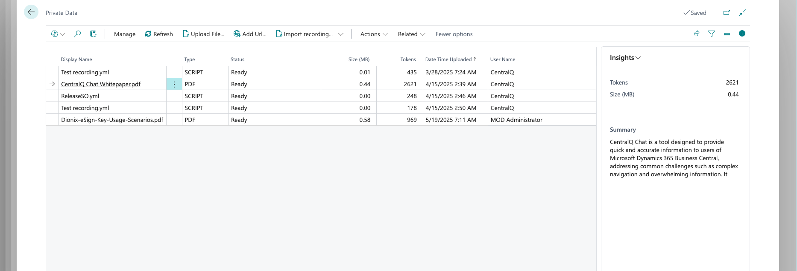

# Private Data Overview

Private documents are a key component of CentralQ Chat, allowing you to personalize the AI's responses to your specific Microsoft Dynamics 365 Business Central environment. This section covers how to add and manage your organization's documents to enhance the relevance and accuracy of the information you receive.

## What are Private Documents?

Private documents in CentralQ Chat include any Business Central-related materials specific to your organization:

- Business Central guides and manuals
- Company-specific documentation
- Internal processes and procedures
- Custom extension documentation
- Training materials
- Reference guides

## Supported Document Types

CentralQ Chat supports various document formats to accommodate different types of content:

- **PDF files**: Documentation, manuals, and guides
- **Office documents**: Word, Excel, PowerPoint
- **Text files**: Plain text documentation
- **YAML files**: For page scripting and workflow automation
- **Web content**: Information from public websites and applications

## Adding Private Documents

There are three primary methods for adding private documents to CentralQ Chat:

### File Upload

Upload your Business Central-related documents directly through the CentralQ Chat interface. The system processes these files, extracting content that becomes searchable when you ask questions.

[Learn more about adding files](./add-files.md)

### Webpage Integration

Connect CentralQ Chat to your public websites to include this content in your knowledge base.

[Learn more about adding webpages](./add-webpages.md)

### Page Scripting

CentralQ Chat supports importing page scripting directly from YAML files or through links. This feature enables:

- **Automated User Manual Generation**: Automatically creates detailed user manuals in the current language setting of Business Central
- **Direct Interaction Through Chat**: Chat responses include actionable URLs for executing relevant page scripting workflows
- **Edit and Export Options**: Edit manuals directly within CentralQ Chat and export them in various formats like Word or YAML

[Learn more about page scripting](./add-page-scripts.md)

## Managing Private Documents

After adding private documents to CentralQ Chat, you can:

- View and organize your uploaded files and connected webpages
- Edit and update user manuals generated from page scripts
- Export documentation in various formats
- Remove outdated materials
- Monitor which documents are being referenced in chat responses

## Security and Privacy

Security is a top priority for private document handling in CentralQ Chat:

- **Secure Storage**: All files are stored in private Azure Blob Storage, accessible only through secure, authenticated methods
- **Controlled Access**: Download your files directly from the Private Data page or through temporary links valid for only 15 minutes
- **Data Protection**: Your private documents are exclusively used to enhance the chat experience and never for AI model training
- **Isolated Content**: Document content is stored in a cloud Qdrant database linked specifically to your chat ID
- **Protected Credentials**: Azure Keyvault securely stores sensitive information like chat IDs and keys

## Best Practices

To maximize the effectiveness of your private documents:

- Upload comprehensive, well-structured documentation
- Use clear, descriptive file names
- Keep your documentation updated when processes change
- Consider breaking large documents into focused, topic-specific files
- For page scripts, ensure they follow the proper YAML format
- Regularly review your private documents to ensure relevance 