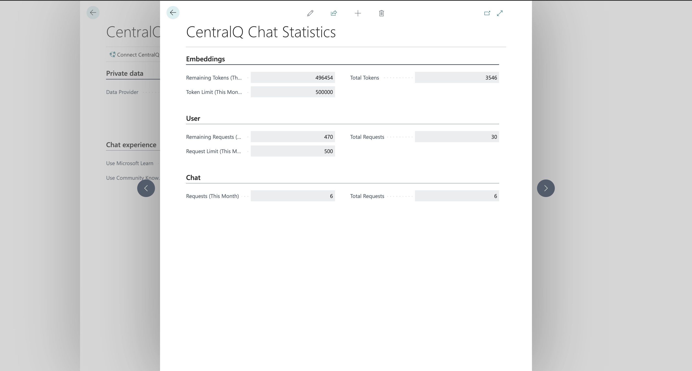

Access detailed usage statistics of CentralQ Chat through the menu: `Search > CentralQ Chat Setup > Statistics` or `Search > CentralQ Chat > Statistics`. The Statistics page is divided into three main sections: Embedding, User, and Chat.

### Embedding Statistics

Statistics provides insights into the tokens used for embedding private data linked to your Chat ID.

#### Remaining Tokens (This Month)

- **Description**: Shows the number of tokens left for embedding private data in the current month.
- **Reset Schedule**: The remaining tokens reset at the start of each new month.

#### Token Limit (This Month)

- **Purpose**: Displays the total token allowance for the current month.

#### Total Tokens

- **Overview**: Cumulative count of tokens used for uploading private data since the beginning.

!!! warning "Important"
    Deleting a file and uploading a new one adds to the total token count. Plan your uploads carefully to optimize token usage. 
    
    Let's say you have uploaded a file with 1000 tokens and then deleted it. If you upload a new file, that consumed 500 tokens, the total token count will be 1500.

#### Monthly Token Limit

- **Current Limit**: The monthly embedding limit is set at 500,000 tokens, equivalent to about 1,000 PDF pages.

### User Requests Statistics

Track your request usage and limits with these statistics.

#### Remaining Requests (This Month)

- **Available Requests**: Count of requests left for the current month.
- **Monthly Reset**: Resets at the beginning of each month.

#### Request Limit (This Month)

- **Total Allowance**: Indicates the total number of requests you can make in the current month.

#### Total Requests

- **Cumulative Count**: Shows the total number of requests made since you started using CentralQ Chat.

### Chat Usage Statistics

Get an overview of the company's overall engagement with CentralQ Chat.

#### Requests (This Month)

- **Company Usage**: Total number of requests made by the company in the current month.

#### Total Requests

- **Overall Engagement**: Cumulative count of requests made by the company since the start of using CentralQ Chat.

!!! note
    These statistics provide valuable insights for monitoring and managing your engagement with CentralQ Chat, ensuring optimal usage and resource allocation.