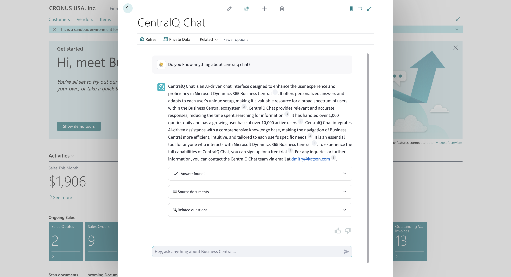
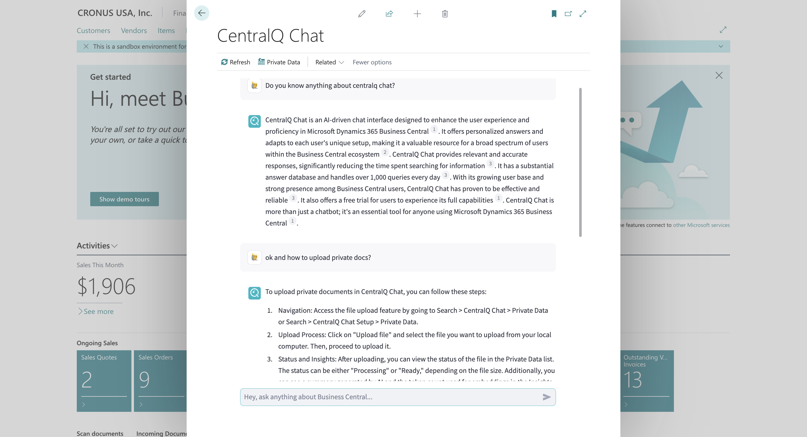

# CentralQ Chat White Paper

## The Need for CentralQ Chat

### Challenges with Business Central

Microsoft Dynamics 365 Business Central is a powerful tool for business management, but its extensive range of features can sometimes be overwhelming, especially for new users or those unfamiliar with certain aspects of the system. Some of the common challenges faced by Business Central users include:

- **Complex Navigation**: With its comprehensive functionalities, navigating through Business Central to find specific features or information can be daunting.
- **Overwhelming Information**: The sheer volume of documentation available online and offline can be time-consuming and confusing to sift through.
- **Keeping Up-to-Date**: Business Central is frequently updated, making it a challenge to stay current with the latest features and best practices.

These challenges can lead to inefficiencies and frustrations, impacting productivity and the user experience.

### Purpose of CentralQ Chat

CentralQ Chat is designed to bridge the gap between the complexity of Business Central and the user's need for quick, accurate information. It addresses the common pain points of sifting through dense documentation or online resources to find answers about specific Business Central functionalities. By providing instant responses sourced from a blend of private documents, Microsoft Learn, and a rich repository of community knowledge, CentralQ Chat significantly enhances productivity and operational efficiency.

The core value of CentralQ Chat lies in its ability to deliver relevant, personalized answers. Understanding that each Business Central environment is unique, with its specific set of extensions and AppSource apps, CentralQ Chat adapts to each user’s environment. This customization ensures that the solutions and information provided are not just generic but are specifically applicable to the user's unique setup.

## Key Features of CentralQ Chat

### 1. AI-Driven Assistance
CentralQ Chat revolutionizes how users interact with Business Central through its AI-driven assistance. This advanced system is designed to provide not just instant responses, but ones that are accurately tailored to the user’s specific query. Leveraging the latest in artificial intelligence technology, CentralQ Chat interprets questions, searches through various data sources, and delivers precise answers, simplifying the complexity of Business Central.

### 2. Comprehensive Knowledge Base
CentralQ Chat's strength lies in its diverse and extensive knowledge base, which includes:

   - **Private Documents**: Users can upload their own guides, manuals, and documentation. This feature personalizes the AI’s responses, making them more relevant to the user’s specific Business Central setup.

   - **Microsoft Learn Integration**: Access to Microsoft’s official, up-to-date documentation ensures that users receive reliable and current information directly from the source.
   - **Community Knowledge**: A wealth of insights is available from community-generated content, including expert blogs, instructional videos, tweets, and authoritative books, providing a broader perspective on various topics.

### 3. Interactive and Transparent Responses
Interaction with CentralQ Chat goes beyond receiving answers. Users can delve deeper into topics, ask follow-up questions, and explore related areas, all through a conversational interface. Every response from CentralQ Chat includes citations from relevant sources, adding a layer of transparency and credibility to the information provided.

### 4. Multilingual Support
While CentralQ Chat is optimized for English, offering its best performance in this language, it also supports queries in other languages. This feature makes CentralQ Chat accessible to a wider audience, although users should note that the accuracy of responses in languages other than English may vary.

### 5. Customizable User Experience
One of the most notable aspects of CentralQ Chat is its adaptability to user preferences. Users are in control of their experience, deciding whether to use just private documentation, official documentation from Microsoft Learn, community resources, or a combination of these sources. This feature ensures that the AI’s responses are aligned with the user's specific informational needs and preferences.

## How CentralQ Chat Works

CentralQ Chat transforms the way users interact with Microsoft Dynamics 365 Business Central by integrating advanced AI technology and user-centric design. Here's an overview of how it operates:

### User Workflow
The workflow in CentralQ Chat is straightforward yet powerful:

1. **Upload Documents**: Users start by uploading their Business Central-related documents. This could include guides, manuals, or any relevant material that they want the AI to use for providing personalized answers.
2. **Ask Questions**: Through an intuitive chat interface, users can ask any operational questions about Business Central. These could range from basic queries to complex requests for information.
3. **Receive AI-Generated Responses**: CentralQ Chat employs advanced AI algorithms to analyze the query, search through the available knowledge base, and generate accurate, context-relevant answers.

For more detailes on usage, visit our [getting started](https://docs.katson.com/centralq-chat/getting-started/) page.

### Behind the Scenes
CentralQ Chat's efficacy lies in its sophisticated backend processes:

- **AI Models and Technology**: At its core, CentralQ Chat utilizes cutting-edge AI models, including OpenAI's GPT-3.5, to understand user queries and generate responses.
- **Ranking Mechanism**: To source information, CentralQ Chat applies a smart ranking system. This system prioritizes sources based on user settings – private documents are usually given the highest priority, followed by Microsoft Learn and Community Knowledge. The AI then combines insights from these sources to provide the most comprehensive answer possible.

### Chat Interface
CentralQ Chat’s interface is designed for ease of use and efficiency:

- **User-Friendly Design**: The chat interface is clean, intuitive, and easy to navigate, ensuring users of all technical backgrounds can interact with it without difficulty.
- **Interactive Features**: Users can engage in a dynamic conversation with the AI, ask follow-up questions, and receive in-depth information. This interactive nature allows for a more engaging and productive user experience.

Through a combination of user-friendly design, sophisticated AI technology, and a comprehensive knowledge base, CentralQ Chat provides an unparalleled tool for enhancing the Business Central experience.

## Pricing and Plans

CentralQ Chat offers a straightforward and value-driven pricing model tailored to meet the needs of businesses of all sizes using Microsoft Dynamics 365 Business Central. Understanding the cost and associated benefits is crucial for potential users to make informed decisions.

### CentralQ Chat Pro

- **Monthly Subscription**: CentralQ Chat is priced at $20 per user per month, making it an affordable addition to any Business Central environment.
- **Annual Subscription**: For those seeking a longer commitment, an annual subscription is available at $200 per user per year, offering almost 2 months of free usage per year.
- **Inclusive Features**: The paid plan includes full access to all features of CentralQ Chat, including AI-driven assistance, integration with Microsoft Learn, Community Knowledge access, and the ability to upload and use private documents. This comprehensive access ensures users have all the tools they need for an enhanced Business Central experience.
- **Private Data Limits**: Users can upload up to 100 MB of private documents monthly, equivalent to approximately 1000 pdf pages, providing ample capacity for most businesses' needs.
- **Request Limits**: Each user under the paid plan can make up to 500 requests per month, ensuring frequent and consistent access to the AI-driven insights.

### Free Trial Period

- **Duration**: CentralQ Chat offers a 30-day free trial, allowing potential users to experience the full range of features and benefits without any upfront commitment.
- **Trial Limitations**: No limitations are imposed during the trial period, ensuring that users can explore the app's capabilities without any restrictions.
<!-- - **Trial Limitations**: During the trial period, users have access to all the features of the paid plan but with slightly reduced limits. The private data limit is 30 MB, and the user request limit is 100 for the trial month. -->

## Security and Privacy

CentralQ Chat places a high priority on the security and privacy of its users' data, particularly in terms of how files and private data are stored and accessed. Understanding these measures is essential for users to trust and rely on the application for their sensitive business operations.

### Secure File Storage and Controlled Access

- **Private Azure Blob Storage**: Files uploaded to CentralQ Chat are securely stored in private Azure Blob Storage. This secure storage method ensures that user files are not publicly accessible and can only be retrieved through secure, authenticated methods.
- **Controlled File Access**: CentralQ Chat employs stringent controls for file access. Users can download their files directly from the Private Data page within CentralQ Chat or through temporary, time-limited links provided in chat responses. These temporary links are valid for only 15 minutes, significantly reducing the risk of unauthorized access or sharing.

### Data Privacy and Ethical Use

- **Private Data Handling**: CentralQ Chat treats private data with the utmost respect. User-uploaded documents and web content are exclusively used to enhance the chat experience and are not utilized for AI model training or any other purposes that could compromise user privacy.
- **Telemetry and Chat Data**: While CentralQ Chat does collect telemetry data, including chat interactions, this information is used solely for analytical purposes to improve the app’s functionality. It is never used for AI model training, ensuring that user interactions remain confidential and are utilized in a manner that respects user privacy.

### Ensuring Comprehensive Data Security

- **Cloud Qdrant for Content Storage**: User content, such as files and web page data, is securely stored in a cloud Qdrant database. This method links the content specifically to the user's unique chat ID, ensuring that the data is isolated and accessible only within that particular user's environment.
- **Azure Keyvault for Sensitive Information**: CentralQ Chat leverages Azure Keyvault to store sensitive information like chat IDs and keys. This approach guarantees that access to this critical data is restricted to authorized personnel and systems, enhancing overall data security.

### Commitment to User Privacy

CentralQ Chat is committed to upholding the highest standards of data privacy and security. This commitment is evident in the app's architecture, which is designed to protect user data, and in its operational policies, which prioritize user privacy in every aspect of the app's functionality. With CentralQ Chat, users can be confident that their data is secure and their privacy is respected, making it a trustworthy tool for managing Business Central information.

## Benefits and Impact

CentralQ.ai - free and public version of CentralQ Chat, has made a significant impact in the world of Microsoft Dynamics 365 Business Central, revolutionizing how users interact with and understand Business Central. 

- **Daily Interactions**: CentralQ handles over 1,000 queries every day, providing timely and relevant answers to a wide array of Business Central-related questions.
- **Growing User Base**: With over 10,000 active users, CentralQ Chat has established a strong presence among Business Central users. This growing community reflects the app's effectiveness and user satisfaction.
- **Substantial Answer Database**: To date, CentralQ Chat has delivered more than 100,000 answers, which is x3 times more than the official Business Central forum during the 2023 year, demonstrating its capacity to handle a high volume of queries with consistency and reliability.

## Target Audience

CentralQ Chat is ideal for a broad spectrum of users within the Business Central ecosystem, ranging from new users seeking to understand the basics of Business Central to seasoned professionals looking for advanced operational insights. It serves as a valuable resource for:

- **Business Central Administrators**: Who need quick answers for system management and troubleshooting.
- **End Users**: Such as accountants, project managers, and sales personnel who regularly interact with Business Central for various operational tasks.
- **Business Decision Makers**: Looking for strategic insights and efficiencies within Business Central to improve business processes.
- **IT Professionals and Consultants**: Who assist businesses in implementing and customizing Business Central.

In essence, CentralQ Chat is not just a tool but a companion for anyone who interacts with Microsoft Dynamics 365 Business Central, ensuring that they can make the most out of this powerful business management solution.

## Conclusion

CentralQ Chat represents a leap forward in the way users interact with Microsoft Dynamics 365 Business Central. By integrating AI-driven assistance with a comprehensive knowledge base, CentralQ Chat transforms the experience of navigating Business Central, making it more efficient, intuitive, and tailored to each unique business environment.

### The Core Value Proposition

- **Efficiency and Accuracy**: CentralQ Chat significantly reduces the time spent searching for information, providing precise answers instantly.
- **Customized Knowledge Base**: With the ability to integrate private documents, official Microsoft Learn resources, and extensive community knowledge, CentralQ Chat offers a personalized experience that aligns with each user's specific Business Central setup.
- **Interactive and User-friendly**: The AI-driven chat interface is not just a tool for answers but also a platform for learning and exploration, enhancing user understanding and proficiency in Business Central.
- **Security and Privacy**: CentralQ Chat upholds the highest standards of data security and privacy, ensuring that user data is protected and utilized solely for enhancing the chat experience.

### Transform Your Business Central Experience

CentralQ Chat is more than just a chatbot; it's an essential tool for any user of Microsoft Dynamics 365 Business Central. Whether you're looking to streamline your operations, enhance your understanding of Business Central, or just need a reliable source for quick answers, CentralQ Chat is your go-to solution.

**Take the First Step**: Experience the full capabilities of CentralQ Chat by signing up for a free trial. For any inquiries or further information, feel free to contact us. Embrace the future of Business Central navigation with CentralQ Chat today!

## Contact Information
For any questions or information about CentralQ Chat, please feel free to email to `dmitry@katson.com`